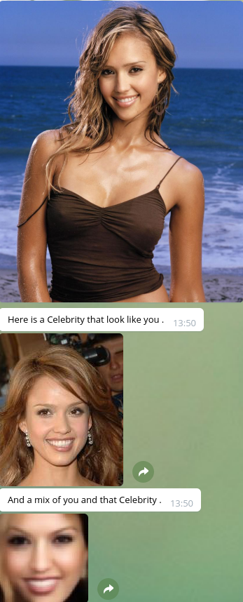
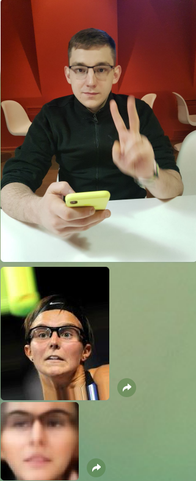

# CelebrityFaceSDA

In this git repository, we are providing code that we are using in our version of Celebrity Faces.
You can try how well this is working in t.me/CelebrityFaces_bot


## Dependencies
* Python 3 with numpy,sklearn,PIL,face_recognition
* Tensorflow (1.0+), we recomended to use r1.7
* Pytorch 0.3


Tested on Ubuntu 18.04
First, you must download the pre-trained model from  https://github.com/davidsandberg/facenet ( Pre-trained models)


### Done
 * We have done required module (3 points)
 * Was realized good approximate method (3 people 0.5 points)
 * Our own neural network to get embeddings (1 point)
 * Was realized method which generates face which is similar to yours and Celebrity you look like. (0.7 points)

### Face detection and cropping 
 As it mentioned in https://github.com/davidsandberg/facenet ,  best result the best way to detect face we can approach by using MTCNN , we do it with 
https://pypi.python.org/pypi/face_recognition (built using dlib’s state-of-the-art face recognition) deep learning library.
 Also we used VAE main architecture provided in github https://github.com/bhpfelix/Variational-Autoencoder-PyTorch


### Index
 Index was written using Locality-Sensitive Hashing algorithm. We use 10 bits for hashing embeddings. We use 5 hash tables. Index was realized using compiling language C++ and was connected to Telegram Bot using Cython.
 


### Our NN
 * To get embeddings we use VAE with BCE + KDE losses.
 * To generate face which is similar to yours and Celebrity one we decode mean value between two these two faces embeddings.

### Dataset
You can find here http://mmlab.ie.cuhk.edu.hk/projects/CelebA.html (img_align_celeba)

### Usage
You can try bot here t.me/CelebrityFaces_bot

#### Your own bot:
##### Compile LSH:
```
cd CelebrityFacesShad/src/LSH/
make lsh_py_module
```
##### Getting embedings:
Use Getting_embeddings.ipynb in Notebooks .

##### Training VAE
Use Getting_embeddings.ipynb with minor changes to get cropped dataset using  Facecrop.py.
Use VAE ipython notebook in Notebooks folder to train your model on cropped images.

##### Bot
First create your own token from BotFather. Past that token in CelebrityFacesBot.py.
Than move trained model and file with embeddings to Bot/.
```
cd CelebrityFacesShad/Bot/

python CelebrityFacesBot.py
```
#### Algorithm comparison

| Algorithm     | Search    | Preprocessing |
| ------------- |:---------:| -------------:|
| LSH           | O(dl)     | O(dnl+nwh)    |
| Brute-force   | O(nwh)    |      -        |
| Trees         | O(logn)(when dim big O(n))| O(nlogn+nwh)   |

Where:

1) n - object count

2) d - space dimention(about 10)

3) l - number of hash tables(about 5)

4) w,h - image width and height

### Time
LSH preprocesing takes about 10 second.Search works almost immediatly.


#### Examples


### License
Our code is released under MIT License (see LICENSE file for details).

